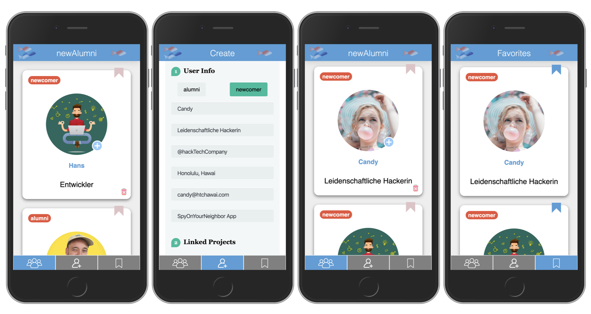

# newAlumni

I developed **newAlumni** as my final project during the web developement bootcamp at [neuefische](https://www.neuefische.de/) in spring 2020.

The idea of newAlumni is to connect newcomer of the web development bootcamp with former bootcamp students.

With newAlumni you can create a profile to let others know about your current job, your contact details as well as your capstone project and further projects on github.

## Preview

newAlumni is hosted via firebase.

Switch your browser to responsive mode (iPhone 6/7/8 plus) as this app was designed for mobile usage.

Click here to view [newAlumni](https://evas-project.firebaseapp.com).

## Tech stack

This project was bootstrapped with [Create React App](https://github.com/facebook/create-react-app).

- React
- Node.js
- firebase/firebase-storage

## Dependencies

- material-ui
- firebase
- prop-types
- react-hook-form
- react-hooks-lib
- react-router-dom
- uuid
- styled-components

## Setup

Clone git repository

### `npm install`

In the project directory

### `npm start`

will throw you an error as of a missing sensitive key needed for firebase. To view the app in the browser please click [here](https://evas-project.firebaseapp.com).

## Acknowledgement

Many many thanks to the entire neuefische team and to all of my classmates! Thank you for all your help & support! 💖
